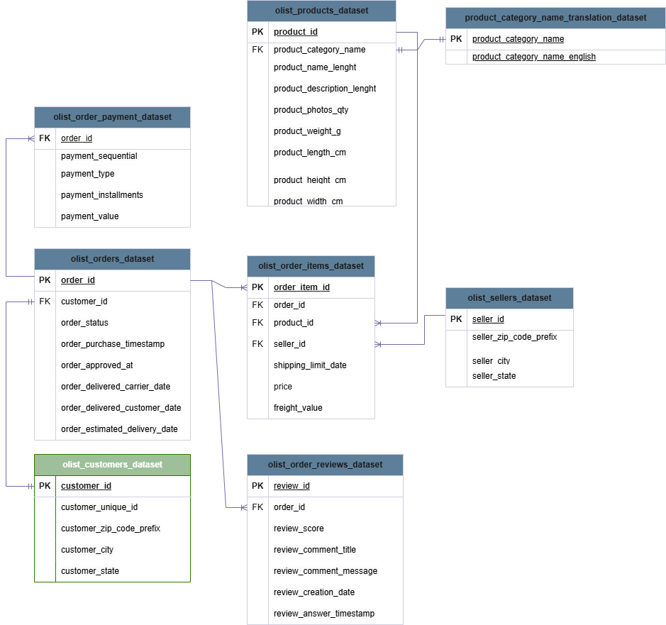
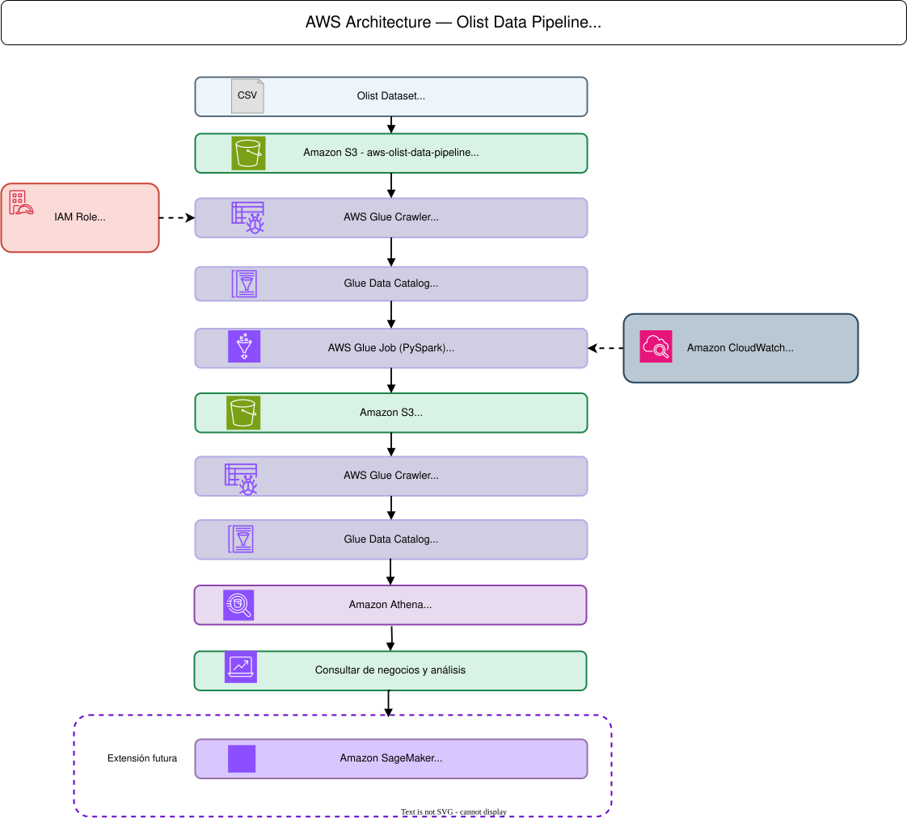
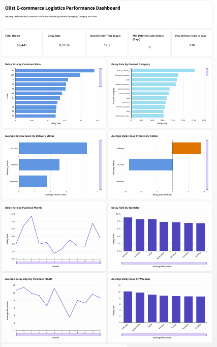

# Pipeline Analítico de E-commerce en AWS con Olist

## 1. Descripción del proyecto

Este proyecto implementa un pipeline de ingeniería de datos en AWS para integrar, transformar, almacenar y analizar información del **Brazilian E-Commerce Public Dataset by Olist**.

El objetivo es construir una capa analítica que permita evaluar el desempeño logístico de los pedidos y estudiar su relación con la satisfacción del cliente.

La solución implementa un flujo batch utilizando Amazon S3, AWS Glue, Glue Data Catalog y Amazon Athena. Los datos originales en formato CSV son transformados mediante PySpark y almacenados posteriormente en formato Parquet para su explotación analítica.

> **Estado del proyecto:** v1 funcional — Data Engineering + Analytics.   
> El proyecto continúa en desarrollo con futuras extensiones de visualización, Machine Learning, orquestación e IA generativa.


---

## 2. Escenario de negocio

### Contexto

Una empresa de e-commerce dispone de información distribuida en diferentes fuentes operacionales relacionadas con pedidos, productos, clientes, vendedores, entregas y reseñas.

### Problema

La información fragmentada dificulta analizar de forma integrada el desempeño logístico, identificar retrasos y estudiar su relación con la experiencia del cliente.

### Necesidad de negocio

Construir un pipeline que centralice, limpie y transforme la información histórica para generar datasets analíticos orientados a consultas de negocio.

### Pregunta principal

**¿Cómo se relaciona el desempeño de las entregas con la satisfacción del cliente y qué regiones o categorías presentan mayores problemas logísticos?**

### Extensión de Machine Learning

La arquitectura y el dataset analítico permiten posteriormente entrenar un modelo para estimar la probabilidad de retraso de un pedido utilizando únicamente información disponible antes de conocer el resultado de la entrega.


---

## 3. Dataset

**Fuente:** Brazilian E-Commerce Public Dataset by Olist.

### Tablas consideradas en la V1

| Dataset | Uso |
|---|---|
| `olist_orders_dataset.csv` | Estado y fechas del pedido |
| `olist_order_items_dataset.csv` | Productos, vendedores, precio y flete |
| `olist_customers_dataset.csv` | Identificación y ubicación del cliente |
| `olist_products_dataset.csv` | Categoría y características físicas del producto |
| `olist_order_reviews_dataset.csv` | Puntuación y comentarios de satisfacción |
| `olist_sellers_dataset.csv` | Información del vendedor |
| `product_category_name_translation.csv` | Traducción de categorías al inglés |

Los datasets de pagos y geolocalización forman parte del dataset original, pero no fueron necesarios para responder el objetivo principal de la primera versión.


---

### Modelo de datos

Se realizó un diagrama entidad-relación para identificar llaves lógicas, cardinalidades y relaciones entre las diferentes fuentes.



---

## 4. Arquitectura de la solución




El pipeline implementado sigue el flujo:

```text
Olist CSV
   ↓
Amazon S3 - raw
   ↓
AWS Glue Crawler
   ↓
Glue Data Catalog - olist_raw_db
   ↓
AWS Glue Job - PySpark
   ↓
Amazon S3 - processed / Parquet
   ↓
AWS Glue Crawler
   ↓
Glue Data Catalog - olist_analytics_db
   ↓
Amazon Athena
   ↓
Análisis de negocio
``` 

---


### Servicios AWS

| Servicio          | Función y justificación                                                                                                                                                 |
| ----------------- | ----------------------------------------------------------------------------------------------------------------------------------------------------------------------- |
| Amazon S3         | Almacena las capas `raw` y `processed`. Se utilizó por su escalabilidad, bajo acoplamiento con el procesamiento y compatibilidad con formatos analíticos como Parquet.  |
| AWS Glue          | Ejecuta el proceso ETL utilizando PySpark. Permite integrar las fuentes, transformar variables y generar los datasets analíticos sin administrar infraestructura Spark. |
| Glue Data Catalog | Registra los esquemas tanto de los datos originales (`olist_raw_db`) como de los datos procesados (`olist_analytics_db`).                                               |
| Amazon Athena     | Ejecuta consultas SQL directamente sobre los archivos Parquet almacenados en S3 sin necesidad de aprovisionar una base de datos analítica.                              |
| Amazon CloudWatch | Almacena logs y permite monitorear las ejecuciones del Glue Job.                                                                                                        |
| AWS IAM           | Controla los permisos del pipeline mediante un rol específico para AWS Glue.                                                                                            |


---

## 5. Organización de datos en S3

Estructura prevista:

``` 
s3://aws-olist-data-pipeline/
│
├── raw/
│   ├── orders/
│   ├── order_items/
│   ├── order_reviews/
│   ├── category_translation/
│   ├── customers/
│   ├── products/
│   └── sellers/
│
├── processed/
│   ├── orders_analytics/
│   └── category_analytics/
│
└── athena-results/
``` 

La capa raw conserva los archivos originales, mientras que processed contiene las salidas generadas por AWS Glue en formato Parquet.

---

## 6. Procesamiento y transformaciones

El procesamiento se implementó mediante un AWS Glue Job desarrollado en PySpark.

El job:

* Lee las tablas registradas en olist_raw_db.
* Convierte columnas de fecha almacenadas originalmente como string a timestamp.
* Integra las distintas fuentes mediante joins.
* Agrega order_items antes del join final para conservar el grano de una fila por pedido.
* Genera variables logísticas, económicas y de producto.
* Agrega las reseñas por pedido.
* Genera dos datasets analíticos.
* Escribe los resultados en formato Parquet en Amazon S3.

### Datasets generados

* orders_analytics
Una fila por pedido.
Contiene 99,441 registros.

Está orientado al análisis logístico, satisfacción y futura construcción de modelos de Machine Learning.

* category_analytics

Una fila por combinación pedido-categoría.
Contiene 99,470 registros.
Permite analizar métricas logísticas y de satisfacción desde la perspectiva de las categorías de producto.

### Variables derivadas principales

| Variable                  | Definición                                                 |
| ------------------------- | ---------------------------------------------------------- |
| `estimated_delivery_days` | Días entre la compra y la fecha estimada de entrega        |
| `actual_delivery_days`    | Días entre la compra y la fecha real de entrega            |
| `delay_days`              | Diferencia entre la entrega real y la fecha estimada       |
| `is_delayed`              | Indicador de pedido entregado después de la fecha estimada |
| `item_count`              | Número de ítems incluidos en el pedido                     |
| `product_count`           | Número de productos distintos                              |
| `seller_count`            | Número de vendedores distintos                             |
| `total_price`             | Valor acumulado de los productos                           |
| `total_freight`           | Valor acumulado del flete                                  |
| `order_value`             | `total_price + total_freight`                              |
| `main_product_category`   | Categoría dominante del pedido                             |
| `avg_product_weight_g`    | Peso promedio de los productos                             |
| `avg_product_volume_cm3`  | Volumen promedio de los productos                          |
| `avg_review_score`        | Puntuación promedio asociada al pedido                     |
| `review_count`            | Cantidad de reseñas asociadas                              |
| `has_review_comment`      | Indica si existe comentario textual                        |
| `purchase_year`           | Año de compra                                              |
| `purchase_month`          | Mes de compra                                              |
| `purchase_day_of_week`    | Día de la semana de la compra                              |

---

## 7. Análisis con Athena

Los datasets procesados son consultados con Amazon Athena utilizando olist_analytics_db.

Las consultas se encuentran versionadas en `athena/queries/`:

```
01_delay_rate.sql
02_reviews_vs_delays.sql
03_delays_by_state.sql
04_delays_by_category.sql
05_delivery_time.sql
```

`Athena/run_query.py` permite ejecutar las consultas desde un entorno local mediante boto3.
`python athena/run_query.py athena/queries/01_delay_rate.sql`
El script envía la consulta a Athena, espera su finalización y muestra los resultados en la terminal.

---

## 8. Resultados
Los análisis realizados hasta el momento muestran:

| Indicador                                 | Resultado |
| ----------------------------------------- | --------: |
| Pedidos totales procesados                |    99,441 |
| Pedidos con información válida de entrega |    96,476 |
| Pedidos retrasados                        |     7,827 |
| Tasa de retraso                           |     8.11% |
| Review promedio — pedidos retrasados      |      2.57 |
| Review promedio — pedidos a tiempo        |      4.29 |

Los pedidos retrasados presentan una calificación promedio 1.72 puntos inferior a los pedidos entregados a tiempo, mostrando una asociación importante entre desempeño logístico y satisfacción del cliente.

En el análisis geográfico, estados como AL y MA presentaron algunas de las mayores tasas de retraso observadas, mientras que estados con mayor volumen como RJ también acumularon una cantidad considerable de entregas tardías.


### 9. Seguridad

Se creó el rol: `AWSGlueServiceRole-OlistPipeline` para permitir que AWS Glue acceda únicamente a los recursos necesarios.

Se configuró una política específica sobre **aws-olist-data-pipeline**, evitando otorgar acceso general mediante AmazonS3FullAccess.

Los permisos contemplan:
* Lectura sobre la capa raw;
* Escritura sobre la capa processed;
* Acceso a Glue Data Catalog;
* Generación de logs del proceso.

El bucket tiene versionado habilitado para conservar versiones de los objetos.

Las credenciales AWS no se almacenan en el repositorio.

---
## 10. Monitoreo

Amazon CloudWatch se utiliza para monitorear la ejecución de los procesos de AWS Glue.

* validar ejecuciones en estado Succeeded
* inspeccionar esquemas PySpark
* verificar transformaciones
* confirmar la generación de 99,441 registros en orders_analytics
* confirmar la generación de 99,470 registros en category_analytics
* diagnosticar errores durante el desarrollo.

---

## 11. Ejecucion del proyecto

### Requisitos
* Python 3
* AWS CLI configurado
* boto3
* credenciales AWS con los permisos correspondientes

### Validar la autenticación:
```aws sts get-caller-identity```

### Ingesta
```python ingestion/upload_raw_to_s3.py```

### Creación del catálogo raw
```python infrastructure/create_glue_catalog.py```

### Configuración del classifier CSV
```python infrastructure/create_csv_classifier.py```

### Creación de tablas con esquema explícito
```python infrastructure/create_manual_glue_tables.py```

### Catálogo analítico
```python infrastructure/create_analytics_catalog.py```

### Consultas Athena
```python athena/run_query.py athena/queries/01_delay_rate.sql```

El Glue Job olist_transform.py debe ejecutarse dentro de AWS Glue debido a su dependencia del runtime de Glue y PySpark.
---

## 12. Estructura del repositorio

```text
aws-olist-data-pipeline/
│
├── README.md
├── .gitignore
│
├── data/
│   ├── README.md
│   └── get_data.py
│
├── ingestion/
│   └── upload_raw_to_s3.py
│
├── infrastructure/
│   ├── create_glue_catalog.py
│   ├── create_csv_classifier.py
│   ├── create_manual_glue_tables.py
│   └── create_analytics_catalog.py
│
├── glue/
│   └── olist_transform.py
│
├── athena/
│   ├── run_query.py
│   └── queries/
│       ├── 01_delay_rate.sql
│       ├── 02_reviews_vs_delays.sql
│       ├── 03_delays_by_state.sql
│       ├── 04_delays_by_category.sql
│       └── 05_delivery_time.sql
│
├── architecture/
│   └── ...
│
└── docs/
    └── screenshots/
```

---
## 14.   Dashboard con Amazon QuickSight
Se construyó un dashboard analítico conectado a `olist_analytics_db` mediante Amazon Athena y SPICE.

El tablero permite explorar:

- tasa de retraso general;
- tiempo promedio de entrega;
- satisfacción promedio;
- retrasos por estado;
- retrasos por categoría;
- patrones mensuales;
- patrones por día de la semana.



---

## 13. Machine Learning  próxima versión

Una evolución natural del proyecto consiste en entrenar un modelo de clasificación que estime:
```P(is_delayed = 1)```

La implementación prevista utilizará Amazon SageMaker y XGBoost. Las features deberán limitarse a información conocida antes de la entrega para evitar data leakage.

---

## 14. Próximas mejoras

- Crear un dashboard analítico con Amazon QuickSight.
- Entrenar el modelo de riesgo de retraso con Amazon SageMaker.
- Automatizar la ejecución mediante AWS Step Functions o Glue Workflows.
- Definir la infraestructura mediante Terraform.
- Analizar las reseñas textuales utilizando NLP o Amazon Bedrock.
- Incorporar validaciones adicionales de calidad de datos.
- Evaluar estrategias de particionamiento de los datasets Parquet.

---

## 15. Tecnologías Implementadas

- Amazon S3
- AWS Glue
- AWS Glue Data Catalog
- Amazon Athena
- Amazon CloudWatch
- AWS IAM
- Python
- PySpark
- SQL
- Parquet
- boto3

Roadmap

* Amazon QuickSight
* Amazon SageMaker
* AWS Step Functions
* Terraform
* Amazon Bedrock